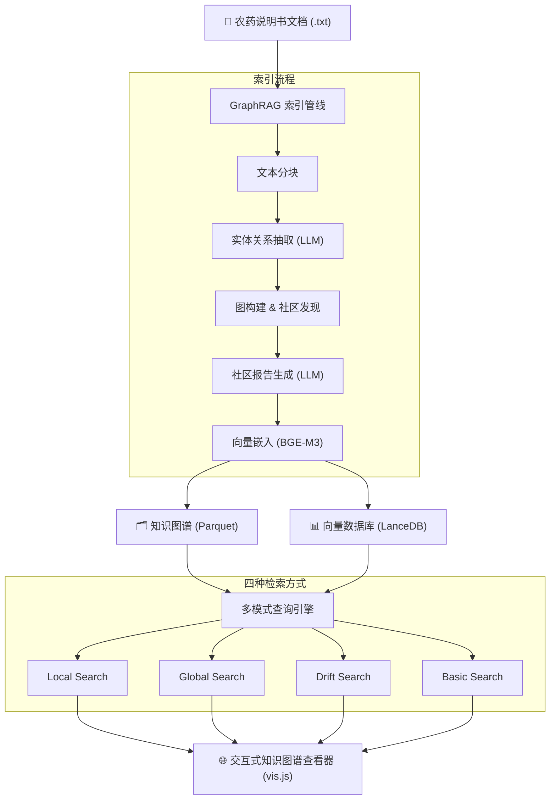

# PestiGraph: 农药知识图谱智能问答系统

基于 [Microsoft GraphRAG](https://github.com/microsoft/graphrag) 构建的农药登记信息知识图谱，支持实体关系抽取、社区发现、多种检索方式的智能问答，以及交互式知识图谱可视化。

## 系统架构



## 功能特性

- **实体关系抽取**: 从农药说明书中自动提取产品、有效成分、作物、防治对象、企业等实体及其关系
- **知识图谱构建**: 自动构建知识图谱，支持社区发现和社区报告生成
- **四种查询模式**:
  - `Local Search`: 向量检索 + 子图遍历，适合具体产品/成分查询
  - `Global Search`: 基于社区报告的 Map-Reduce，适合全局汇总分析
  - `Drift Search`: 漂移搜索，结合局部和全局信息
  - `Basic Search`: 纯向量检索
- **交互式可视化**: 基于 vis.js 的实体关系图查看器，支持按类型筛选、搜索、详情查看

## 环境要求

- Python 3.10+
- [Ollama](https://ollama.com/) (本地运行 BGE-M3 嵌入模型)
- [MiMo API Key](https://platform.xiaomimimo.com/) (用于 LLM 推理)

## 快速开始

### 1. 安装依赖

```bash
pip install graphrag pandas tiktoken
```

### 2. 安装并启动 Ollama 嵌入模型

```bash
ollama pull bge-m3
ollama serve
```

### 3. 配置 API Key

```bash
cd graphrag_project
cp .env.example .env
# 编辑 .env，填入你的 MiMo API Key
```

### 4. 准备输入数据

将农药说明书文本文件放入 `graphrag_project/input/` 目录（每个文件一条记录）。

项目提供了 100 条样例数据用于测试：

```bash
cp -r graphrag_project/sample_input/ graphrag_project/input/
```

### 5. 运行索引

```bash
cd graphrag_project
python -m graphrag index -r .
```

索引过程包含以下步骤：
1. **load_input** - 加载文本文件
2. **create_text_units** - 文本分块
3. **extract_graph** - LLM 抽取实体和关系
4. **summarize_descriptions** - 实体描述摘要
5. **create_communities** - Leiden 社区发现
6. **community_reports** - LLM 生成社区报告
7. **generate_text_embeddings** - 向量嵌入

### 6. 查询测试

```bash
python query_test.py
```

进入交互模式后，先选择查询方式再输入问题：

```
/l  - Local Search  (适合具体问题，如"含有三唑酮的农药有哪些")
/g  - Global Search (适合全局汇总，如"常见的农药剂型有哪些")
/d  - Drift Search  (漂移搜索)
/b  - Basic Search  (基础搜索)
```

### 7. 知识图谱可视化

```bash
python serve_viewer.py
```

自动导出图数据并在浏览器中打开交互式查看器（默认 http://localhost:8080）。

## 项目结构

```
agriculture-rga/
├── graphrag_project/
│   ├── settings.yaml          # GraphRAG 配置（模型、分块、查询参数）
│   ├── .env.example           # API Key 模板
│   ├── prompts/               # LLM 提示词模板
│   ├── sample_input/          # 100 条样例数据
│   ├── query_test.py          # 交互式查询工具
│   ├── export_graph_json.py   # 图数据导出 (Parquet → JSON)
│   ├── graph_viewer.html      # vis.js 交互式查看器
│   ├── serve_viewer.py        # 一键启动查看器
│   ├── prepare_input.py       # 数据预处理脚本
│   └── analyze_tokens.py      # Token 统计分析工具
├── .gitignore
└── README.md
```

## 配置说明

核心配置在 `graphrag_project/settings.yaml`：

| 配置项 | 当前值 | 说明 |
|--------|--------|------|
| LLM | mimo-v2.5-pro | 实体抽取、社区报告生成 |
| Embedding | bge-m3 (Ollama) | 本地向量嵌入，1024 维 |
| Chunk Size | 3000 tokens | 大于最大文档长度，保证不切分 |
| Entity Types | 农药产品、有效成分、作物等 8 类 | 领域定制实体类型 |

## 已知问题

- **部分 LLM 不支持 json_schema**: 需要使用 `response_format_json_object=True` 替代 Pydantic 结构化输出
- **Ollama BGE-M3 偶发 NaN**: 极少数中文文本会导致嵌入向量包含 NaN，已在嵌入层添加零向量兜底

## License

MIT
